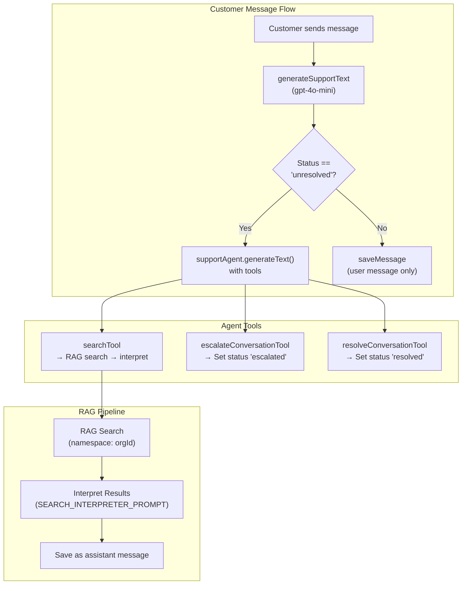
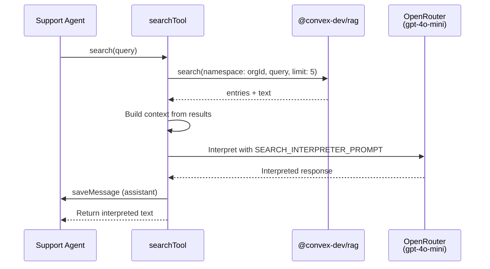
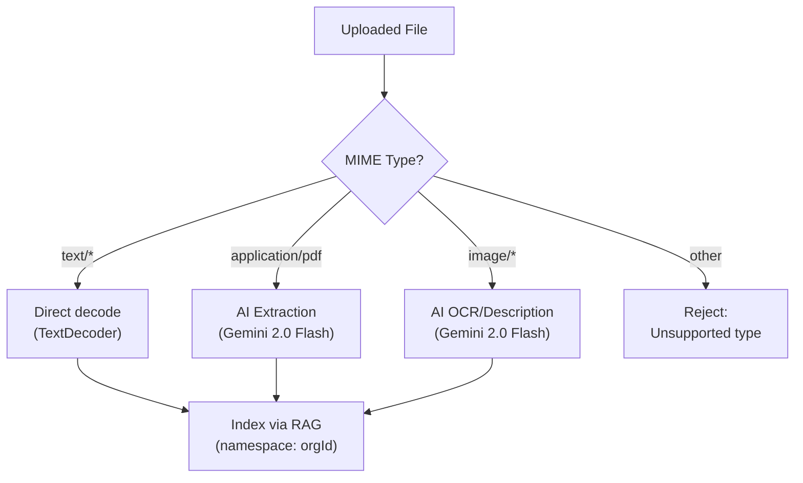
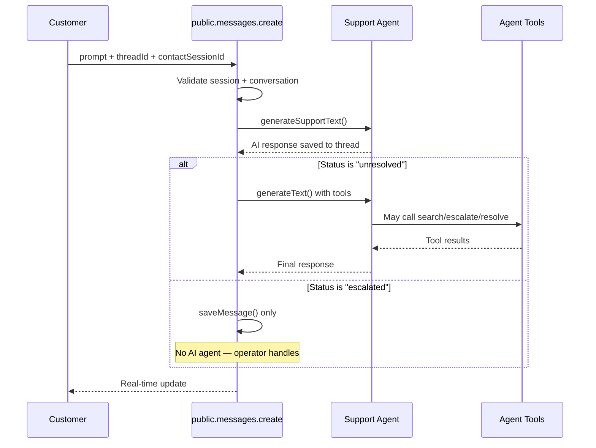
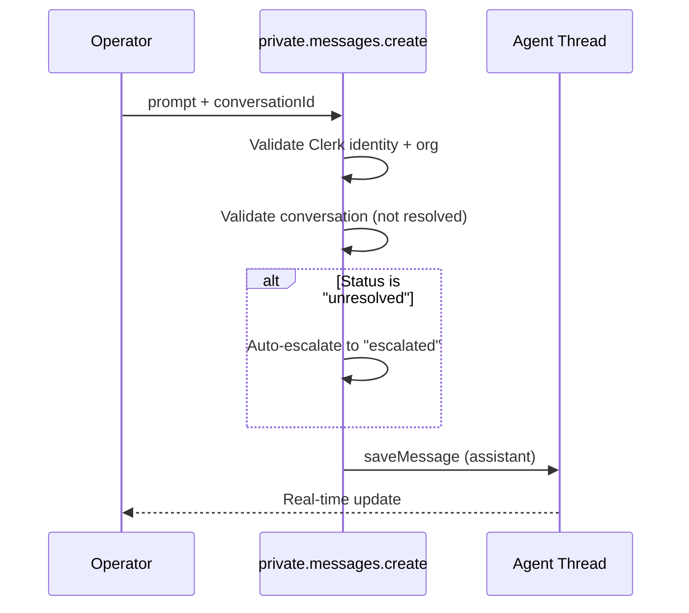
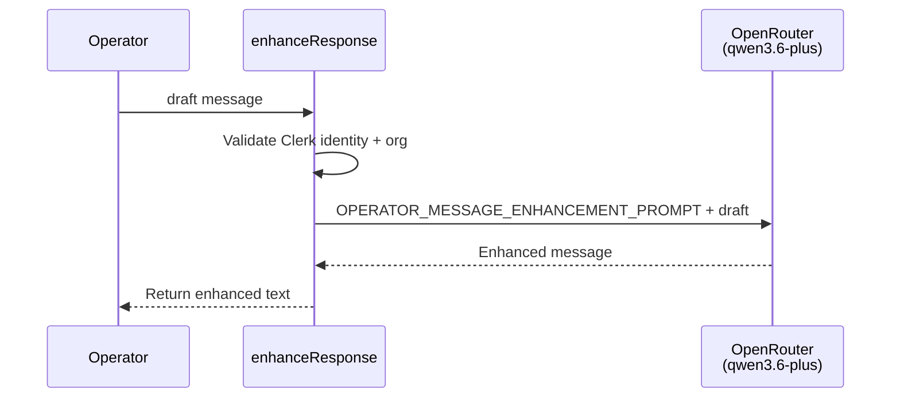

# AI System

Cortex uses an AI agent with RAG-powered knowledge base search, conversation management tools, and multi-model support.

## Architecture

## Support Agent

Defined in `packages/backend/convex/system/ai/agents/supportAgent.ts`.

- **Framework**: `@convex-dev/agent`
- **Model**: OpenRouter → `openai/gpt-4o-mini`
- **Max tokens**: 1024
- **Instructions**: `SUPPORT_AGENT_PROMPT` (see constants below)

The agent is stateless per-call but maintains conversation history via threads managed by `@convex-dev/agent`.

## RAG (Retrieval-Augmented Generation)

Defined in `packages/backend/convex/system/ai/rag.ts`.

- **Framework**: `@convex-dev/rag`
- **Embedding model**: OpenRouter → `openai/text-embedding-3-small`
- **Embedding dimension**: 1536
- **Namespacing**: Per `organizationId` — each org has its own search space
- **File storage**: Convex file storage with content hashing for deduplication

### Search Flow

## Tools

### searchTool

Searches the organization's knowledge base and interprets results.

**Input**: `{ query: string }`

**Flow**:
1. Look up conversation → get `organizationId`
2. Search RAG: `rag.search({ namespace: orgId, query, limit: 5 })`
3. Build context text from search results
4. Generate interpretation using `SEARCH_INTERPRETER_PROMPT`
5. Save interpreted response as assistant message
6. Return interpreted text

### escalateConversationTool

Marks conversation as escalated (requires human operator).

**Input**: `{}` (uses threadId from context)

**Flow**:
1. Call `system.conversations.escalate` with threadId
2. Save "Conversation escalated to a human operator." message
3. Return confirmation

### resolveConversationTool

Marks conversation as resolved.

**Input**: `{}` (uses threadId from context)

**Flow**:
1. Call `system.conversations.resolve` with threadId
2. Save "Conversation resolved." message
3. Return confirmation

## File Processing

Defined in `packages/backend/convex/lib/extractTextContent.ts`.

| File Type | Processing | Model |
|---|---|---|
| Plain text | Direct decode | None |
| PDF | AI extraction | Google Gemini 2.0 Flash |
| Images (JPEG, PNG, WebP, GIF) | AI OCR/description | Google Gemini 2.0 Flash |
| Other | Rejected with error | — |

Extracted text is then indexed via RAG with:
- **Namespace**: Organization ID
- **Key**: Filename
- **Content hash**: Prevents re-indexing unchanged files
- **Metadata**: `storageId`, `uploadedBy`, `filename`, `category`

## Operator Message Enhancement

Defined in `packages/backend/convex/private/messages.ts` → `enhanceResponse`.

- **Model**: OpenRouter → `qwen/qwen3.6-plus`
- **Max tokens**: 1024
- **Purpose**: Polishes operator draft messages for professionalism while preserving intent
- **Prompt**: `OPERATOR_MESSAGE_ENHANCEMENT_PROMPT`

## Prompt Constants

All prompts are in `packages/backend/convex/system/ai/constants.ts`.

### SUPPORT_AGENT_PROMPT
- Identity: Friendly AI support assistant
- Must search knowledge base before answering product questions
- Escalate when unsure or when customer requests human help
- Resolve when customer is satisfied
- Never make up information — only use search results

### SEARCH_INTERPRETER_PROMPT
- Interprets RAG search results into conversational answers
- Faithful to search results only — no invention
- Offers human support when results are insufficient

### OPERATOR_MESSAGE_ENHANCEMENT_PROMPT
- Enhances operator messages for clarity and professionalism
- Preserves original intent, specific details, and tone
- Fixes grammar, removes redundancy, structures information
- Returns only the enhanced message

## Message Flow Details

### Customer sends a message (public API)

### Operator sends a message (private API)

### Operator enhances a draft (private API)

