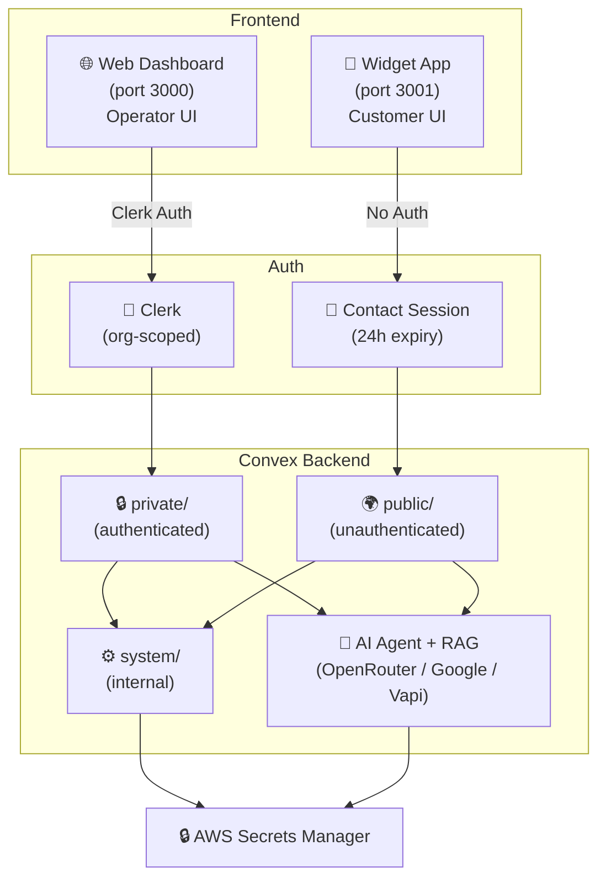
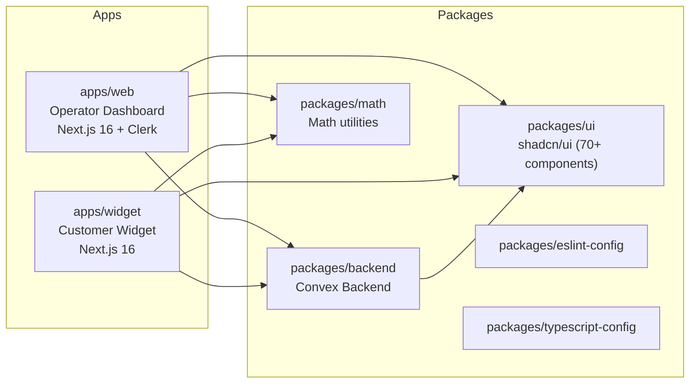
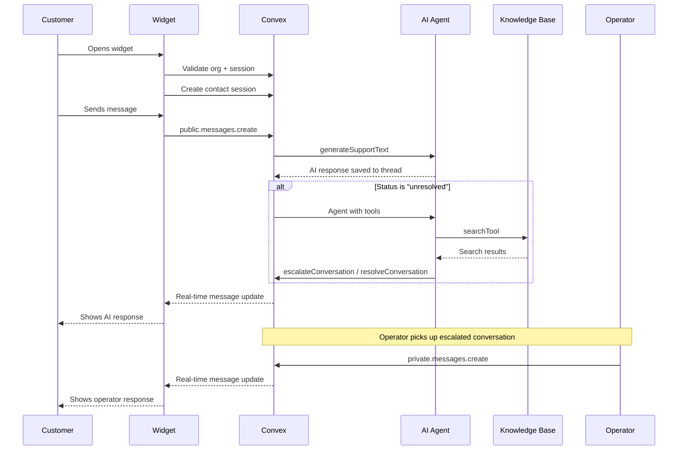

# Architecture Overview

Cortex is an AI-powered customer support platform that enables organizations to provide chat and voice support through an embeddable widget, managed via an operator dashboard.

## High-Level Architecture

## Monorepo Structure

## Tech Stack

| Category | Technology |
|---|---|
| Framework | Next.js 16 (Turbopack) |
| Language | TypeScript 5.9 |
| Database | Convex (realtime, serverless) |
| Auth | Clerk (organization-based) |
| AI Agent | @convex-dev/agent |
| RAG | @convex-dev/rag |
| LLM Gateway | OpenRouter (gpt-4o-mini, qwen3.6-plus) |
| Vision/OCR | Google Gemini 2.0 Flash |
| Voice AI | Vapi (Web SDK + Server SDK) |
| Secrets | AWS Secrets Manager |
| State | Jotai (atoms, atomWithStorage) |
| Forms | react-hook-form + zod |
| UI | shadcn/ui + Tailwind CSS 4 |
| Build | Turborepo + pnpm |

## Data Flow

## Two-App Design

### Web Dashboard (`apps/web`)
- **Users**: Organization operators (support agents)
- **Auth**: Clerk with organization scoping
- **Purpose**: View conversations, respond to customers, manage knowledge base, configure widget, connect integrations

### Widget App (`apps/widget`)
- **Users**: End customers/visitors
- **Auth**: None — uses contact sessions (24h expiry)
- **Purpose**: Chat with AI, voice calls, view conversation history, contact phone support
- **Embedding**: Loaded via `?organizationId=<org_id>` query parameter

## Backend 3-Layer Pattern

The Convex backend uses a strict 3-layer API pattern:

1. **`private/`** — Authenticated endpoints requiring Clerk identity + org membership. Used by the web dashboard.
2. **`public/`** — Unauthenticated endpoints validated via contact sessions. Used by the widget.
3. **`system/`** — Internal-only functions (`internalQuery`, `internalMutation`, `internalAction`). Never exposed to clients, called only by other backend functions.

This separation ensures:
- Operators never access the public API (they have full org context via Clerk)
- Customers never access the private API (they have limited session context)
- Internal mutations/queries are protected from direct client invocation
