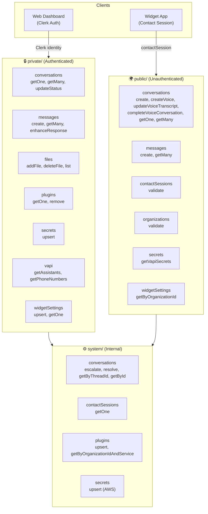

# Backend API Reference

The Convex backend exposes two API surfaces (private and public) plus an internal system layer.

## API Layer Overview

## Private API (`convex/private/`)

Authenticated via Clerk. All endpoints verify `ctx.auth.getUserIdentity()` and scope by `identity.orgId`. Used by the **web dashboard**.

### Conversations

#### `private.conversations.getOne`
Get a single conversation with contact session details.
- **Args**: `conversationId: Id<"conversations">`
- **Returns**: Conversation + contactSession object

#### `private.conversations.getMany`
List conversations with pagination, optional status filter, and last message.
- **Args**: `status?: "unresolved" | "escalated" | "resolved"`, `paginationOpts`
- **Returns**: Paginated list with `contactSession` and `lastMessage` per conversation

#### `private.conversations.updateStatus`
Change conversation status.
- **Args**: `conversationId: Id<"conversations">`, `status: "unresolved" | "escalated" | "resolved"`
- **Returns**: Updated conversation

---

### Messages

#### `private.messages.create`
Send an operator message. Auto-escalates if conversation is unresolved. Only works for chat conversations (with threadId).
- **Args**: `prompt: string`, `conversationId: Id<"conversations">`
- **Side effects**: Sets status to "escalated" if currently "unresolved"

#### `private.messages.getMany`
List messages for a thread.
- **Args**: `threadId: string`, `paginationOpts`
- **Returns**: Paginated message list from agent thread

#### `private.messages.enhanceResponse`
AI-enhance an operator's draft message using OpenRouter (qwen3.6-plus).
- **Args**: `prompt: string`
- **Returns**: Enhanced message text

---

### Files

#### `private.files.addFile`
Upload a file to the knowledge base. Extracts text, indexes via RAG, stores in Convex storage.
- **Args**: `filename: string`, `mimeType: string`, `bytes: ArrayBuffer`, `category?: string`
- **Returns**: `{ url: string, entryId: EntryId }`

#### `private.files.deleteFile`
Remove a file from the knowledge base and storage.
- **Args**: `entryId: EntryId`

#### `private.files.list`
List files in the organization's knowledge base.
- **Args**: `category?: string`, `paginationOpts`
- **Returns**: Paginated list of `PublicFile` objects

---

### Plugins

#### `private.plugins.getOne`
Get a plugin by service type.
- **Args**: `service: "vapi"`
- **Returns**: Plugin record or null

#### `private.plugins.remove`
Remove a plugin.
- **Args**: `service: "vapi"`

---

### Secrets

#### `private.secrets.upsert`
Store API credentials for a service. Delegates to system layer which stores in AWS Secrets Manager.
- **Args**: `service: "vapi"`, `value: any`
- **Side effects**: Creates/updates AWS secret + plugin record

---

### Vapi

#### `private.vapi.getAssistants`
List Vapi assistants for the organization.
- **Returns**: `Vapi.Assistant[]`

#### `private.vapi.getPhoneNumbers`
List Vapi phone numbers for the organization.
- **Returns**: `Vapi.ListPhoneNumbersResponseItem[]`

---

### Widget Settings

#### `private.widgetSettings.upsert`
Create or update widget settings.
- **Args**: `greetMessage`, `defaultSuggestions`, `vapiSettings`

#### `private.widgetSettings.getOne`
Get widget settings for the current organization.
- **Returns**: WidgetSettings or null

---

## Public API (`convex/public/`)

Unauthenticated. Validated via contact sessions. Used by the **widget app**.

### Conversations

#### `public.conversations.create`
Create a new chat conversation. Creates an agent thread and sends the greeting message.
- **Args**: `organizationId: string`, `contactSessionId: Id<"contactSessions">`
- **Returns**: `Id<"conversations">`

#### `public.conversations.createVoice`
Create a voice conversation (no thread, transcript stored directly).
- **Args**: `organizationId: string`, `contactSessionId: Id<"contactSessions">`, `callId?: string`
- **Returns**: `Id<"conversations">`

#### `public.conversations.updateVoiceTranscript`
Append a transcript entry to a voice conversation.
- **Args**: `conversationId`, `contactSessionId`, `role: "user" | "assistant"`, `text: string`

#### `public.conversations.completeVoiceConversation`
Mark a voice call as ended, calculate duration.
- **Args**: `conversationId`, `contactSessionId`

#### `public.conversations.getOne`
Get a conversation by ID (session-scoped).
- **Args**: `conversationId`, `contactSessionId`

#### `public.conversations.getMany`
List conversations for a contact session.
- **Args**: `contactSessionId`, `paginationOpts`

---

### Messages

#### `public.messages.create`
Send a customer message and trigger the AI agent.
- **Args**: `prompt: string`, `threadId: string`, `contactSessionId: Id<"contactSessions">`
- **Behavior**: 
  - Validates session + conversation
  - Calls `generateSupportText` (saves AI response to thread)
  - If conversation is "unresolved", also runs agent with tools (escalate/resolve)
  - If conversation is "escalated", just saves the user message

#### `public.messages.getMany`
List messages for a thread (session-scoped).
- **Args**: `threadId`, `contactSessionId`, `paginationOpts`

---

### Other Public Endpoints

| Endpoint | Args | Description |
|---|---|---|
| `public.contactSessions.validate` | `contactSessionId` | Check if session is valid and not expired |
| `public.organizations.validate` | `organizationId` | Verify org exists via Clerk API |
| `public.secrets.getVapiSecrets` | `organizationId` | Get Vapi public API key (only) |
| `public.widgetSettings.getByOrganizationId` | `organizationId` | Get widget settings for an org |

---

## System Layer (`convex/system/`)

Internal-only functions. Cannot be called from clients.

| Function | Type | Description |
|---|---|---|
| `system.conversations.escalate` | internalMutation | Set conversation status to "escalated" by threadId |
| `system.conversations.resolve` | internalMutation | Set conversation status to "resolved" by threadId |
| `system.conversations.getByThreadId` | internalQuery | Get conversation by threadId |
| `system.conversations.getById` | internalQuery | Get conversation by ID |
| `system.contactSessions.getOne` | internalQuery | Get contact session by ID |
| `system.plugins.upsert` | internalMutation | Create/update plugin record |
| `system.plugins.getByOrganizationIdAndService` | internalQuery | Get plugin by org + service |
| `system.secrets.upsert` | internalAction | Store secret in AWS + create plugin record |
