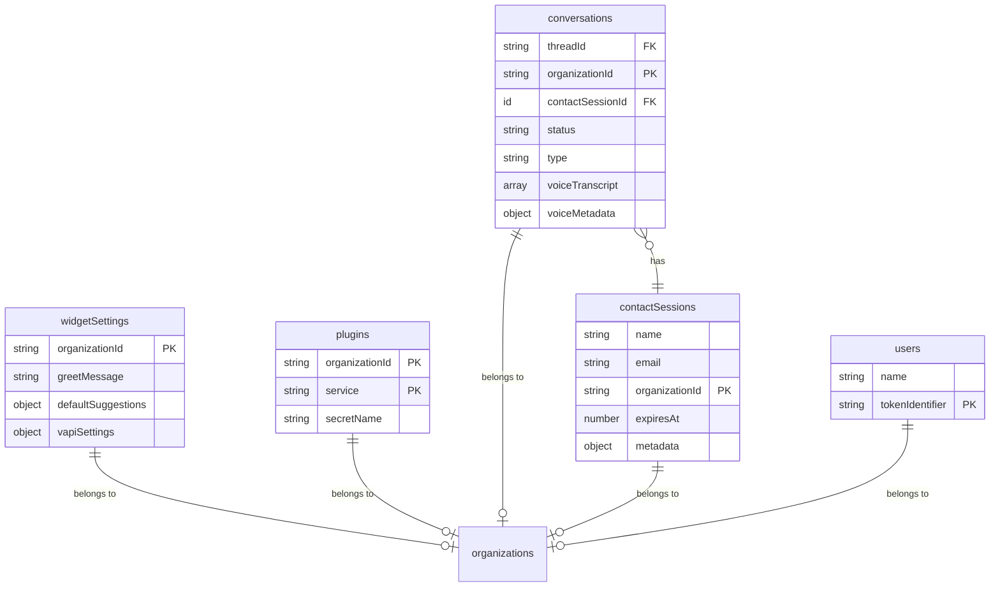
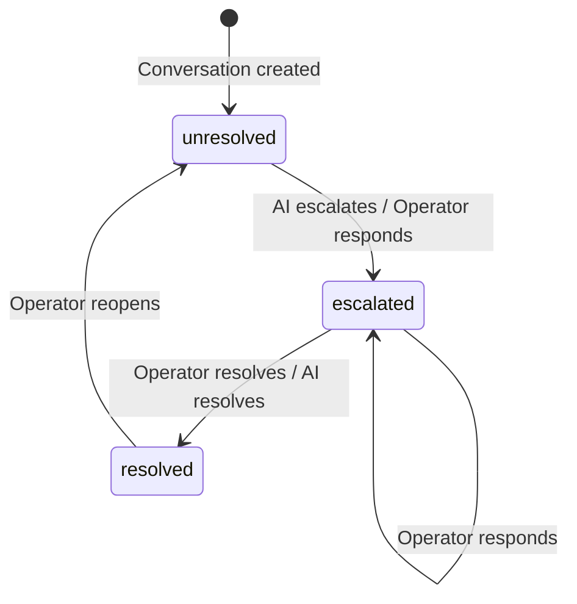

# Database Schema

Convex database with 5 tables. All multi-tenant data is scoped by `organizationId`.

## Entity Relationship Diagram



## Status Lifecycle



## Tables

### `widgetSettings`

Per-organization widget configuration.

| Field | Type | Description |
|---|---|---|
| `organizationId` | `string` | Clerk organization ID |
| `greetMessage` | `string` | Initial greeting shown when chat opens |
| `defaultSuggestions` | `object` | Up to 3 quick-reply suggestions |
| `defaultSuggestions.suggestion1` | `optional<string>` | First suggestion |
| `defaultSuggestions.suggestion2` | `optional<string>` | Second suggestion |
| `defaultSuggestions.suggestion3` | `optional<string>` | Third suggestion |
| `vapiSettings` | `object` | Voice AI configuration |
| `vapiSettings.assistantId` | `optional<string>` | Vapi assistant ID for voice calls |
| `vapiSettings.phoneNumber` | `optional<string>` | Phone number displayed in widget |

**Indexes:**
- `by_organization_id` on `["organizationId"]`

---

### `plugins`

Service integrations per organization.

| Field | Type | Description |
|---|---|---|
| `organizationId` | `string` | Clerk organization ID |
| `service` | `union<"vapi">` | Plugin service type (extensible union) |
| `secretName` | `string` | AWS Secrets Manager secret path |

**Indexes:**
- `by_organization_id` on `["organizationId"]`
- `by_organization_id_and_service` on `["organizationId", "service"]`

---

### `conversations`

Support conversations (chat and voice).

| Field | Type | Description |
|---|---|---|
| `threadId` | `optional<string>` | Agent thread ID (chat conversations only) |
| `organizationId` | `string` | Owning organization |
| `contactSessionId` | `id("contactSessions")` | Associated contact session |
| `status` | `union<"unresolved", "escalated", "resolved">` | Conversation status |
| `type` | `optional<union<"chat", "voice">>` | Conversation type |
| `voiceTranscript` | `optional<array<object>>` | Voice call transcript entries |
| `voiceTranscript[].role` | `union<"user", "assistant">` | Speaker role |
| `voiceTranscript[].text` | `string` | Transcribed text |
| `voiceTranscript[].timestamp` | `number` | Unix timestamp (ms) |
| `voiceMetadata` | `optional<object>` | Voice call metadata |
| `voiceMetadata.callId` | `optional<string>` | Vapi call ID |
| `voiceMetadata.duration` | `optional<number>` | Call duration in seconds |
| `voiceMetadata.startedAt` | `optional<number>` | Call start timestamp |
| `voiceMetadata.endedAt` | `optional<number>` | Call end timestamp |

**Indexes:**
- `by_organization_id` on `["organizationId"]`
- `by_contact_session_id` on `["contactSessionId"]`
- `by_thread_id` on `["threadId"]`
- `by_status_and_organization_id` on `["status", "organizationId"]`

**Status lifecycle:**
```
unresolved → escalated → resolved
     ↑                        │
     └────────────────────────┘
```

---

### `contactSessions`

Temporary visitor sessions (24-hour expiry).

| Field | Type | Description |
|---|---|---|
| `name` | `string` | Visitor name |
| `email` | `string` | Visitor email |
| `organizationId` | `string` | Organization being contacted |
| `expiresAt` | `number` | Expiry timestamp (created + 24h) |
| `metadata` | `optional<object>` | Browser/device metadata |
| `metadata.userAgent` | `optional<string>` | Browser user agent |
| `metadata.language` | `optional<string>` | Primary language |
| `metadata.languages` | `optional<array<string>>` | All browser languages |
| `metadata.platform` | `optional<string>` | OS platform |
| `metadata.vendor` | `optional<string>` | Browser vendor |
| `metadata.screenResolution` | `optional<string>` | Screen dimensions (e.g. "1920x1080") |
| `metadata.viewportSize` | `optional<string>` | Viewport dimensions |
| `metadata.timezone` | `optional<string>` | IANA timezone |
| `metadata.timezoneOffset` | `optional<number>` | UTC offset in minutes |
| `metadata.cookieEnabled` | `optional<boolean>` | Cookie support |
| `metadata.referrer` | `optional<string>` | Referrer URL |
| `metadata.currentUrl` | `optional<string>` | Current page URL |

**Indexes:**
- `by_organization_id` on `["organizationId"]`
- `by_expires_at` on `["expiresAt"]`

---

### `users`

Simple user records (currently minimal).

| Field | Type | Description |
|---|---|---|
| `name` | `string` | User display name |
| `tokenIdentifier` | `string` | Clerk token identifier |

**Indexes:**
- `by_token` on `["tokenIdentifier"]`

> **Note:** The `users` table is currently underutilized. The `add` mutation hardcodes values instead of using Clerk identity data.
