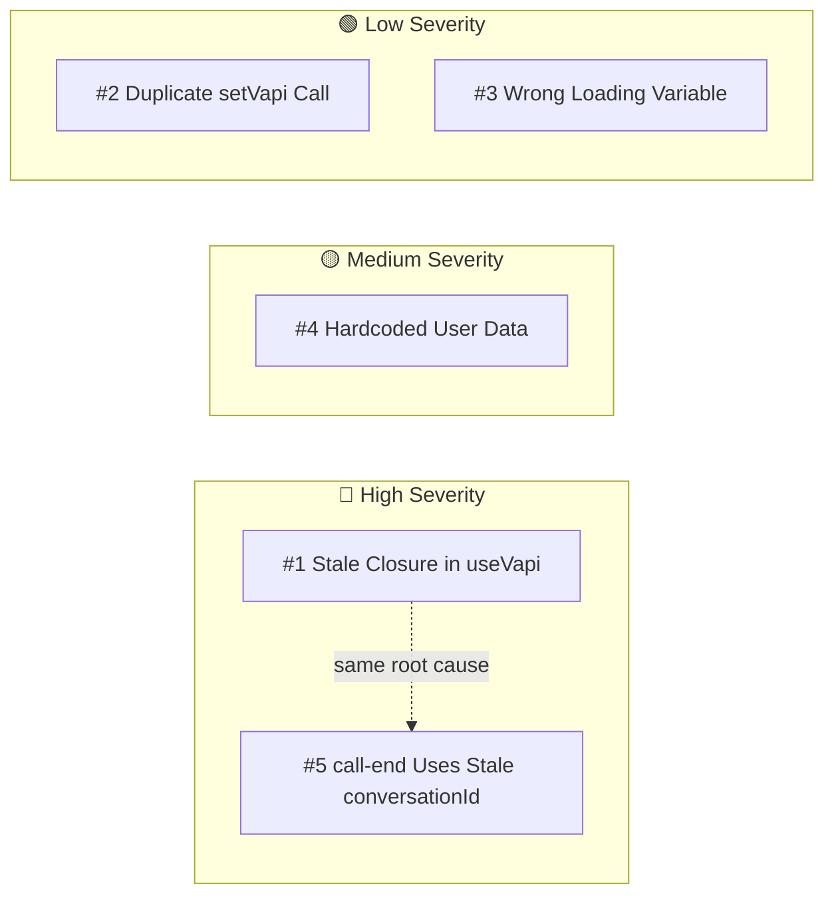

# Known Issues

## Bugs

### Bug Severity Overview



### 1. Stale Closure in `useVapi` Hook
**File**: `apps/widget/modules/widget/hooks/use-vapi.ts`
**Severity**: High

The `useEffect` at line 42 has an empty dependency array `[]`, but references `conversationId`, `contactSessionId`, and `organizationId` inside event handlers. This means:

- `call-end` handler will try to complete a voice conversation using a **stale** `conversationId` (likely `null` since it's set after the effect runs)
- `message` handler will try to update transcript with a **stale** `conversationId`
- The Vapi instance is never recreated when `vapiSecrets` changes

**Fix**: Add proper dependencies to the useEffect, or use refs for values that change during the call lifecycle.

---

### 2. Duplicate `setVapi` Call
**File**: `apps/widget/modules/widget/hooks/use-vapi.ts:49-51`
**Severity**: Low

```ts
setVapi(vapiInstance);  // line 49
setVapi(vapiInstance);  // line 51 — duplicate
```

Causes an unnecessary re-render.

---

### 3. Wrong Loading Variable in Phone Number Placeholder
**File**: `apps/web/modules/customizations/ui/components/vapi-form-fields.tsx:88`
**Severity**: Low

The phone number select placeholder uses `assistantsLoading` instead of `phoneNumbersLoading`:
```ts
placeholder={
  assistantsLoading        // ← should be phoneNumbersLoading
    ? "Loading phone numbers..."
    : "Select a phone number"
}
```

---

### 4. Hardcoded User Data in `add` Mutation
**File**: `packages/backend/convex/users.ts:35-38`
**Severity**: Medium

The `add` mutation ignores the Clerk identity and inserts hardcoded values:
```ts
const users = await ctx.db.insert("users", {
    name: "John Doe",           // ← should use identity.name
    tokenIdentifier: "1234567890", // ← should use identity.tokenIdentifier
});
```

Also, the mutation fetches `orgId` from identity but never uses it.

---

### 5. `call-end` Uses Stale `conversationId`
**File**: `apps/widget/modules/widget/hooks/use-vapi.ts:80`
**Severity**: High (consequence of issue #1)

When the call ends, the handler reads `conversationId` from state, but due to the stale closure, this will be `null` (the initial value). The `completeVoiceConversation` mutation will never be called.

**Fix**: Use a ref to track the current conversationId, or restructure the effect.

---

## Typos / Naming

| Location | Current | Should Be |
|---|---|---|
| `packages/backend/convex/contactSesisons.ts` | `contactSesisons` | `contactSessions` |
| `apps/web/modules/dasboard/` | `dasboard` | `dashboard` |
| `apps/widget/modules/widget/ui/views/widegt-view.tsx` | `widegt-view` | `widget-view` |
| `apps/widget/modules/widget/constants.ts:12` | `echo_contact_sesison` | `echo_contact_session` |
| `packages/backend/convex/contactSesisons.ts:59` | `COntact session expired` | `Contact session expired` |

---

## Security Considerations

### 1. Public API Key Exposure
**File**: `packages/backend/convex/public/secrets.ts`

The `getVapiSecrets` action returns the Vapi **public API key** to unauthenticated users. This is by design (the widget needs it to initialize Vapi), but ensure the public key has appropriate rate limits and restrictions in the Vapi dashboard.

### 2. No Rate Limiting on Public Endpoints
Public endpoints (contact session creation, message sending, conversation creation) have no rate limiting. A malicious user could:
- Flood conversations
- Spam messages
- Create many contact sessions

Consider adding rate limiting via Convex or a CDN/WAF layer.

### 3. Contact Session Reuse
Contact session IDs are stored in localStorage. If a user clears localStorage after 24h, the session expires gracefully. However, a sophisticated user could manipulate the stored session ID to potentially access another visitor's conversations (though session IDs are random Convex IDs, making this impractical).

---

## Missing Features / TODOs

1. **No conversation search** — Operators cannot search conversations by content
2. **No file categories UI** — The backend supports file categories but the UI doesn't expose filtering
3. **No billing page** — Route exists but no content
4. **No integrations page** — Route exists but no content
5. **Voice conversations are view-only in widget inbox** — Cannot reopen or continue a voice conversation
6. **No operator assignment** — Conversations aren't assigned to specific operators
7. **No typing indicators** — No real-time typing status between customer and operator
8. **No file attachments in chat** — Only text messages supported
9. **No conversation export** — Cannot export conversation history
10. **`users` table is essentially unused** — The schema exists but the `add` mutation is broken and no queries use it meaningfully
