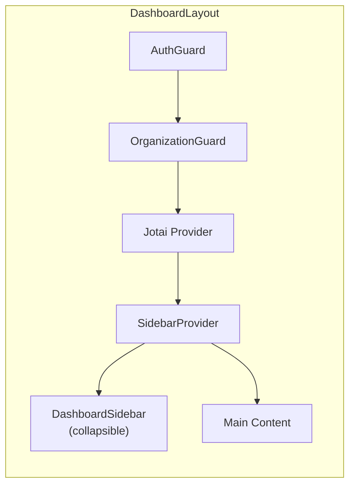
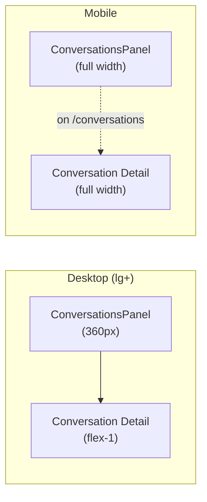
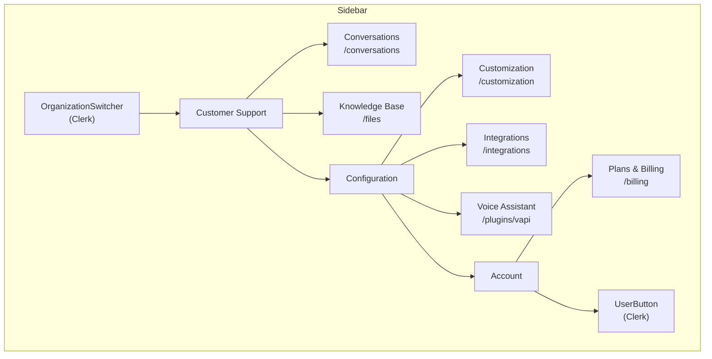
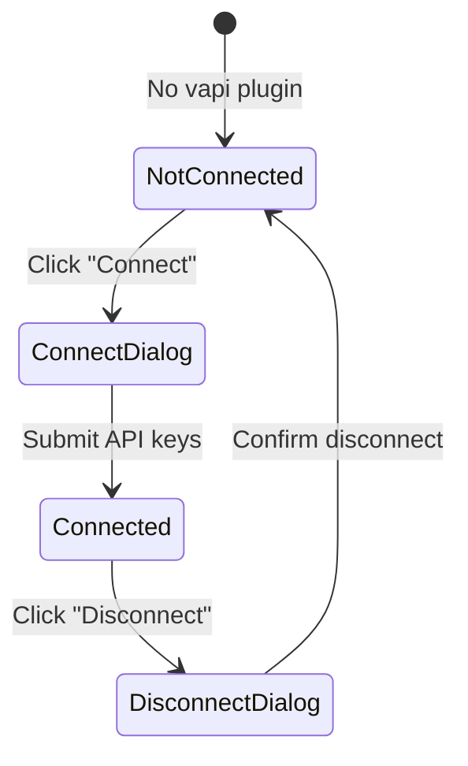

# Web Dashboard

The operator dashboard at `apps/web` (port 3000).

## Overview

- **Authentication**: Clerk with organization scoping
- **Convex integration**: `ConvexProviderWithClerk` — Clerk identity maps to Convex auth
- **Layout**: Collapsible sidebar + main content area

## Providers

```tsx
// apps/web/components/providers.tsx
<ClerkProvider>
  <ConvexProviderWithClerk client={convex} useAuth={useAuth}>
    {children}
  </ConvexProviderWithClerk>
</ClerkProvider>
```

## Middleware

Defined in `apps/web/proxy.ts` (Clerk middleware).

- **Public routes**: `/sign-in`, `/sign-up`, `/sign-out`
- **Protected routes**: All others require authentication
- **Org enforcement**: If user has no `orgId`, redirects to `/org-selection`

## Routes

| Route | View | Description |
|---|---|---|
| `/` | `Page` | Home (placeholder with user list) |
| `/sign-in` | `SignInView` | Clerk sign-in |
| `/sign-up` | `SignUpView` | Clerk sign-up |
| `/org-selection` | `OrgSelectionView` | Organization picker |
| `/conversations` | `ConversationsView` | Conversation list + detail |
| `/conversations/[id]` | `ConversationIdView` | Single conversation |
| `/files` | `FilesView` | Knowledge base file manager |
| `/customization` | `CustomizationView` | Widget settings form |
| `/integrations` | — | Integrations page |
| `/plugins/vapi` | `VapiView` | Vapi plugin management |
| `/billing` | — | Billing page |

## Layouts

### Dashboard Layout



### Conversations Layout



## Sidebar

Defined in `apps/web/modules/dasboard/ui/components/dashboard-sidebar.tsx`.



**Features**:
- Collapsible (icon-only mode)
- Organization switcher (Clerk)
- User button (Clerk)
- Active route highlighting with blue gradient

## Key Views

### Conversations Panel

- Status filter dropdown (All / Escalated / Resolved / Unresolved)
- Stored in localStorage via `statusFilterAtom` (Jotai `atomWithStorage`)
- Each conversation shows: country flag, contact name, last message preview, status badge
- Country detected from timezone/locale metadata
- Infinite scroll pagination

### Conversation Detail

- Thread messages with `useThreadMessages` hook
- **Status toggle button**: Cycles unresolved → escalated → resolved → unresolved
- **AI Enhance button** (Wand2 icon): Sends draft to `enhanceResponse` action
- Disabled input when conversation is resolved
- Loading skeleton state

### Files View

- Table with Name, Type, Size, Actions columns
- Upload dialog (file dropzone)
- Delete dialog with confirmation
- RAG-indexed — uploaded files become searchable by the AI agent

### Customization View

- Form with two cards:
  1. **General Chat Settings**: Greeting message, 3 suggestion inputs
  2. **Voice Assistant Settings** (only shown if Vapi plugin connected):
     - Assistant dropdown (fetched from Vapi API)
     - Phone number dropdown (fetched from Vapi API)

### Vapi Plugin View



- **Not connected**: Shows `PluginCard` with features list + connect button
- **Connected**: Shows `VapiConnectedView` with assistants/phone numbers tabs + disconnect button
- Connect flow: Dialog with public + private API key inputs → stored in AWS Secrets Manager
- Disconnect flow: Confirmation dialog → removes plugin record

## State Management

| Atom | Storage | Purpose |
|---|---|---|
| `statusFilterAtom` | localStorage | Conversation list status filter |

Jotai `Provider` wraps the dashboard layout to isolate atom state.
