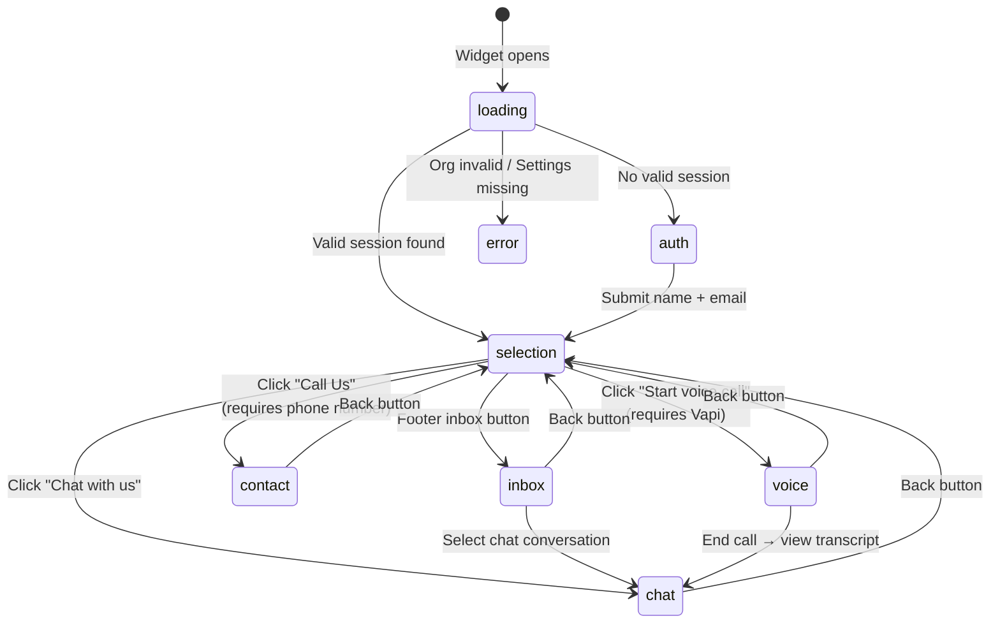
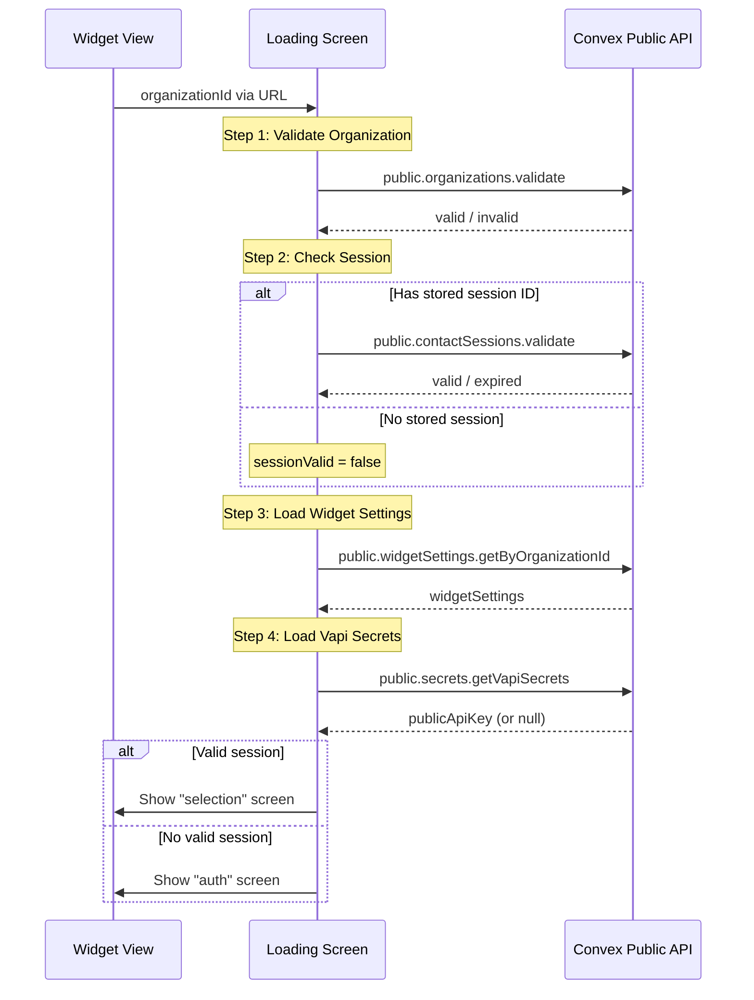
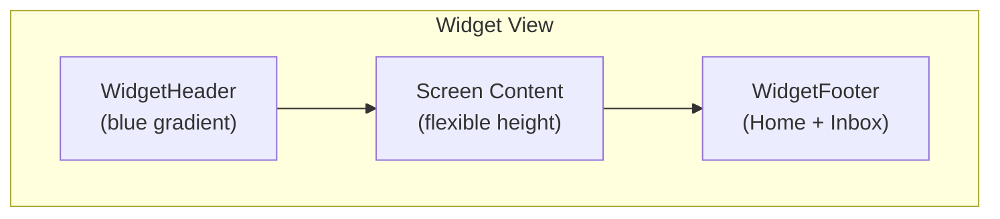

# Widget App

The customer-facing embeddable widget at `apps/widget` (port 3001).

## Overview

- **No authentication** — uses contact sessions (24h expiry) instead of Clerk
- **State management** — Jotai atoms for screen navigation and session data
- **Entry point** — `?organizationId=<org_id>` query parameter

## Providers

```tsx
// apps/widget/components/providers.tsx
<ConvexProvider client={convex}>    // No Clerk — plain Convex provider
  <Provider>                        // Jotai provider
    {children}
  </Provider>
</ConvexProvider>
```

## Screen State Machine



## Initialization Sequence



## Atoms (State)

Defined in `apps/widget/modules/widget/atoms/widget-atoms.ts`.

| Atom | Type | Storage | Purpose |
|---|---|---|---|
| `screenAtom` | `WidgetScreen` | Memory | Current screen |
| `organizationIdAtom` | `string \| null` | Memory | Current org ID |
| `errorMessageAtom` | `string \| null` | Memory | Error display |
| `loadingMessageAtom` | `string \| null` | Memory | Loading status text |
| `conversationIdAtom` | `Id<"conversations"> \| null` | Memory | Active conversation |
| `contactSessionIdAtomFamily` | `Id<"contactSessions"> \| null` | **localStorage** | Per-org session ID |
| `widgetSettingsAtom` | `Doc<"widgetSettings"> \| null` | Memory | Widget config |
| `vapiSecretsAtom` | `{ publicApiKey: string } \| null` | Memory | Vapi credentials |
| `hasVapiSecretsAtom` | Derived | — | Whether voice is available |

## Screens

### Loading Screen (`widget-loading-screen.tsx`)

Initialization sequence:

1. **`org` step** — Validate `organizationId` via `public.organizations.validate`
2. **`session` step** — Check if stored `contactSessionId` is still valid
3. **`settings` step** — Load `widgetSettings` for the organization
4. **`vapi` step** — Load Vapi public API key (for voice features)
5. **`done`** — Route to `selection` (if valid session) or `auth` (if no session)

### Auth Screen (`widget-auth-screen.tsx`)

- Collects **name** and **email** from visitor
- Creates a `contactSession` with browser metadata (userAgent, timezone, screen size, etc.)
- Stores session ID in localStorage via `contactSessionIdAtomFamily`
- Navigates to `selection`

### Selection Screen (`widget-selection-screen.tsx`)

Main menu with up to 3 options:

1. **Chat with us** — Always available. Creates a new chat conversation → navigates to `chat`
2. **Start voice call** — Only if `hasVapiSecrets && vapiSettings.assistantId`. Navigates to `voice`
3. **Call Us** — Only if `hasVapiSecrets && vapiSettings.phoneNumber`. Navigates to `contact`

### Chat Screen (`widget-chat-screen.tsx`)

- Displays thread messages via `useThreadMessages` hook
- Supports infinite scroll (load older messages)
- Shows **suggestion chips** after the first (greeting) message
- Sends messages via `public.messages.create` (triggers AI agent)
- Shows voice transcript for voice-type conversations
- Disables input when conversation is resolved

### Voice Screen (`widget-voice-screen.tsx`)

- Uses `useVapi` hook for Vapi Web SDK integration
- Shows live transcript during call
- Visual indicators: speaking (red pulse) vs listening (green)
- Start/end call buttons
- Transcript persisted to backend via `updateVoiceTranscript`

### Inbox Screen (`widget-inbox-screen.tsx`)

- Paginated list of past conversations
- Shows last message preview, conversation type (chat/voice), status
- Click chat conversation → opens in `chat` screen
- Voice conversations are view-only (disabled)

### Contact Screen (`widget-contact-screen.tsx`)

- Displays phone number from widget settings
- Copy to clipboard button
- "Call Now" button with `tel:` link

### Error Screen (`widget-error-screen.tsx`)

- Generic error display with `AlertTriangleIcon`
- Shows `errorMessageAtom` value

## useVapi Hook

Defined in `apps/widget/modules/widget/hooks/use-vapi.ts`.

**Returns**:
```ts
{
  isSpeaking: boolean,
  isConnected: boolean,
  isConnecting: boolean,
  transcript: TranscriptMessage[],
  conversationId: Id<"conversations"> | null,
  startCall: () => void,
  endCall: () => void,
}
```

**Event handlers**:
- `call-start` → Creates voice conversation in backend, sets `conversationId`
- `call-end` → Calls `completeVoiceConversation` to record duration
- `speech-start/speech-end` → Toggles `isSpeaking`
- `message` (final transcript) → Appends to local transcript + persists via `updateVoiceTranscript`

> **Known issue**: The useEffect has an empty dependency array `[]` but references reactive values (`conversationId`, `contactSessionId`), causing stale closures. See [Known Issues](./known-issues.md).

## Widget Layout


